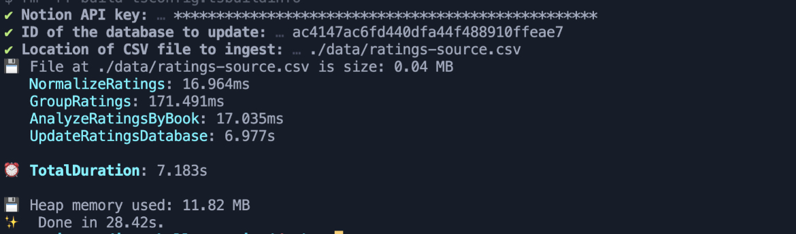

# CSV to Notion Database

## Running the program

1. Install the dependencies
```
yarn install
```

2. Execute the program by passing the file path of the ratings CSV to process as an argument
```
yarn start
```

3. When the program starts, the command-line with prompt you for your (1) Notion API key, (2) the database ID, and (3) the location of the CSV file of ratings data to process and import to your database. Refer to the screenshot below of what it will look like:



## Running tests
```
yarn test
```

## How it works

The responsibility of the program is to receive as inputs (1) the path to a CSV file, (2) a Notion database ID, and (3) an auth token for the Notion API. The program will normalize and dedupe the CSV file, calculate aggregations from it, and persist those results to the specified Notion database.

The CSV file may be arbitrarily large, so the program uses file streams to process the data in a memory efficient manner. More specifically, it will read and normalize each CSV row before running aggregations on it. Once the data for a specific book is ready, the program will persist the it to the database without waiting for the data for all other books to be ready.

### Naive Solution - Read entire file first before running aggregations & persisting to DB

My initial solution works given the `ratings.csv` file from the prompt. However, `ratings.csv` provided has only 41,683 bytes (45 KB on disk). What if the file were larger? What if it were 1 GB?

Possible ways to improve performance and memory footprint:

1. Parallelize as many tasks as possible
2. When computing the average ratings for each book, instead of storing a list of ratings for each book and then iterating through it all at once (which requires us to have the entire list of ratings for a given book first), we can use the Cumulative Average algorithm to gradually build up to the final average rating for each book.
3. Leverage Node.js Streams (+ pipe()) or async file reading solutions


What the flow could look like:

1. Initialize a read stream for the input file (i.e `ratings.csv`) and pipe its output to a transformer reponsible for normalizing the data in each row.
2. Pipe that output to another transformer responsible for mapping each row (at this point, a row is a tuple of strings and numbers) to a Javascript object with properties "book", "member", and "rating".
3. At this point the data is ready for us to run analysis on - AKA we can compute the average ratings and favorites counts for each book.
4. Finally, we persist those book rating summaries to the remote Notion database.

We can't parallelize the latter steps of this flow because the target data we need for each book can only be computed given we've discovered all the data related to it. However, we can parallelize a lot of the beginning parsing and transformation steps right before we run any computations on the data.


## Potential improvements to API documentation
For my use case, the API documentation was detailed enough for me to figure out how to (1) delete all existing entries in a Notion database and (2) add new entries to the database. The only room for improvement I could think of at this moment was that it could be made more obvious that in order to delete an entry (which is actually a page) from a database, you have to "archive" it. 

However, I found more room for improvement when it came to the Notion SDK. Maybe in the future, the Notion Client could include a `notion.database(databaseId: string).delete(pageId: string)` method, through which users can programmatically delete pages within a database.

Furthermore, in order to delete all existing entries in a database, you must first fetch all the ID's of pages in the database, and then archive each page by its ID. I believe another helpful utility to add to the client is a way to clear a database (i.e. `notion.database(databaseId: string).clear()`).

## External sources/links I relied on
- [NotionAPIPlayground](https://github.com/atakanzen/NotionAPIPlayground) - an example Github repo of a project using `@notionhq/client` and `prompts` to interact with the Notion API using a CLI interface
- [Read and Process Very Large Files line by line in Node.js With less CPU and Memory usage.](https://gist.github.com/tusharf5/979d0b67da8830bf34598f6d0ee27d1a)
- [Dealing with huge data files](https://livebook.manning.com/book/data-wrangling-with-javascript/chapter-7/)

## NPM Packages Used
- @notionhq/client - for obvious reasons ;)
- [prompts](https://www.npmjs.com/package/prompts) - to assist in prompting the user for information to run the program like a CLI
- [chalk](https://www.npmjs.com/package/chalk) - to make console logs colorful
- [papaparse](https://www.npmjs.com/package/papaparse) - for parsing CSV files in Javascript; super fast and Papa Parse has no dependencies - not even jQuery.
